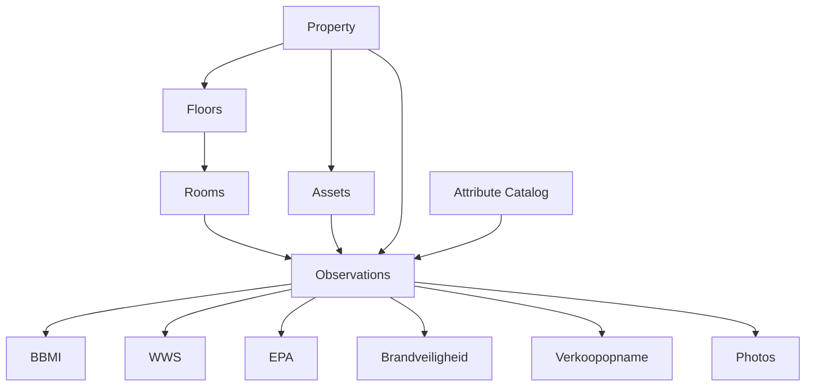

# Domein-overzicht (conceptueel)

Living diagram bij [data-model.md](../data-model.md).  
**Laatst bijgewerkt:** 2026-08-10

Property is de kern. Rooms/Assets zijn subjects. Observations vullen attributes; templates (BBMI, WWS, …) zijn views/configuraties over diezelfde claims — geen aparte apps.

