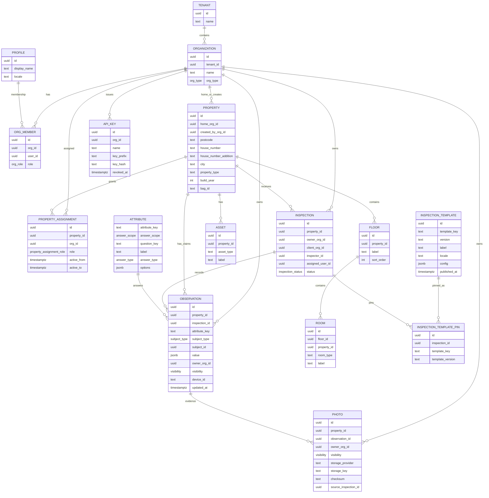

# Domein ER-diagram (Detailed)

Living diagram bij [data-model.md](../data-model.md).  
**Laatst bijgewerkt:** 2026-08-12

## Belangrijke keuzes

| Onderwerp | Keuze | ADR |
|---|---|---|
| Gecombineerde opname | `inspection_template_pins` i.p.v. één template per inspection | [ADR-015](../decisions/ADR-015-combined-inspection.md) |
| Opdrachtgever | `organizations.org_type` + `property_assignments` | [ADR-016](../decisions/ADR-016-client-org-assignment.md) |
| Facts | View `security_invoker`, LWW binnen `owner_org_id` | [ADR-014](../decisions/ADR-014-facts-as-view.md) |
| BAG | Nullable `bag_id`, geen lookup in onze app | — |

`visibility` op Observation / Photo:

| Waarde | Betekenis | MVP |
|---|---|---|
| `private` | Alleen eigenaar-org | In gebruik |
| `shared` | Orgs met expliciete share/grant | Hook, geen UI |
| `public_to_client` | Opdrachtgever van de opname | Hook, geen UI |

**Facts** is geen tabel: view over `observations` (LWW per property/subject/attribute/`owner_org_id`).
