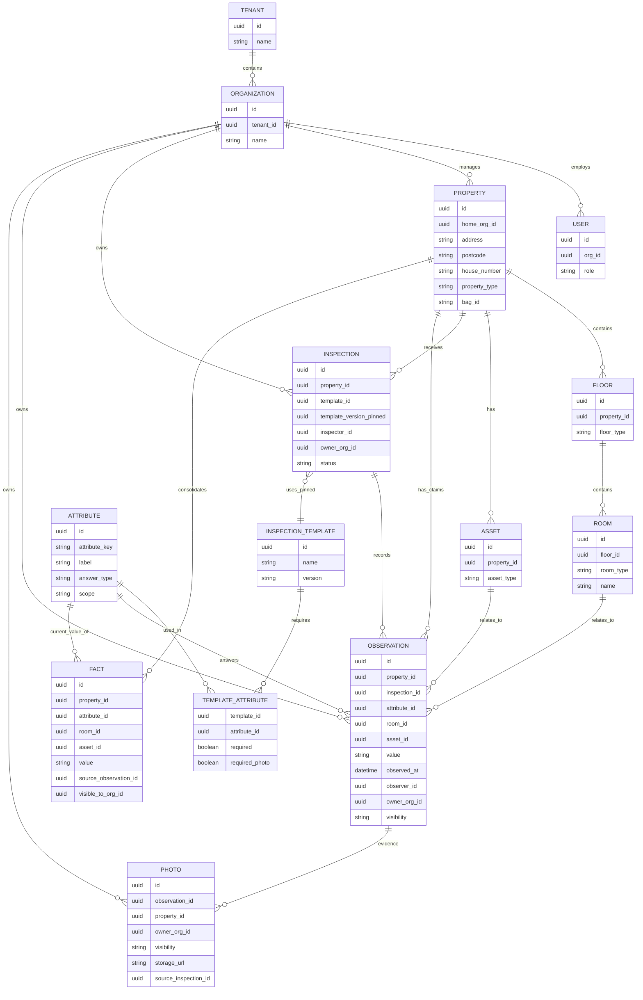

# Domein ER-diagram (Detailed)

Living diagram bij [data-model.md](../data-model.md).  
**Laatst bijgewerkt:** 2026-08-10

## Belangrijke correcties t.o.v. eerdere schets

| Was | Wordt | Waarom |
|---|---|---|
| `ANSWER` | `OBSERVATION` | Claims met tijd, bron, eigenaar; niet alleen “antwoord op vraag” |
| `QUESTION` | `ATTRIBUTE` | Catalogus van gestructureerde attributen; templates selecteren subsets |
| Alleen Inspection → Answer | + `owner_org_id` + `visibility` | Eigenaarschaplaag; geen stille data-overname bij company-wissel |
| Foto alleen aan answer | Photo volgt observation + eigenaar | Bronbestanden blijven van klant/opnemende partij |
| Ontbrekende Facts | `FACT` per zichtbare org-scope | Geconsolideerde waarheid alleen uit observations die de org mag zien |

## Eigenaarschap & visibility

- **Juridisch:** inmeter / inspecteur / opdrachtgever blijft eigenaar van brondata — niet de softwareleverancier.
- **Property** (fysiek: ruimtes, installaties, pandkenmerken) mag centraal/herkenbaar blijven.
- **Inspection, Observation, Photo** hebben `owner_org_id` en zijn niet automatisch beschikbaar voor andere organisaties.
- Bij **company-wissel**: bestaande observations/foto’s/facts van de vorige org worden **niet automatisch** opgenomen.

`visibility` op Observation / Photo:

| Waarde | Betekenis |
|---|---|
| `private` | Alleen eigenaar-org |
| `shared` | Orgs met expliciete share/grant |
| `public_to_client` | Opdrachtgever/client-org van deze opname |

