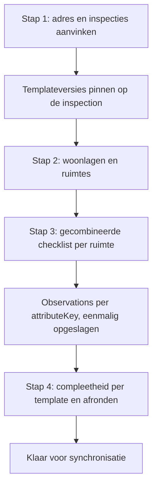
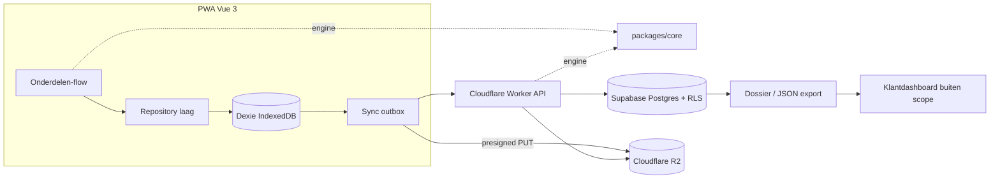

# Vastgoed Opname Platform — uitvoeringsplan (mijlpaal 1 t/m 6)

## Uitgangspunten

Vastgelegd en niet meer ter discussie tijdens uitvoering (bron: [architecture.md](.cursor/docs/architecture.md), [ADR-006](.cursor/docs/decisions/ADR-006-technical-stack.md), [decisions/README.md](.cursor/docs/decisions/README.md)):

- Vue 3 + TypeScript + PWA, IndexedDB via Dexie, Cloudflare Workers API, Supabase Postgres met RLS, Cloudflare R2 voor foto's, Supabase Auth met JWT-validatie in de Worker.
- Property is bron van waarheid; Observations zijn claims met `owner_org_id` + `visibility`; Facts zijn geconsolideerd per zichtbaarheid van de raadplegende org; dossier is een view/export.
- Templates zijn configuratie; `templateVersion` wordt gepind bij start van een opname; verplicht = zichtbaar volgens `showWhen` én in de gepinde template.
- Buiten scope: klantdashboard, rapportgeneratie, EPA/NEN2580/WO/BOG/brand, LiDAR-app, Realworks, partner-CSV, App Store.

Bevestigde keuzes uit dit gesprek:

- **Monorepo** met pnpm workspaces; template-engine één keer geschreven in `packages/core` en hergebruikt door PWA en API.
- **Infra:** Supabase-project bestaat en is gelinkt, R2-bucket bestaat en is gelinkt; daarachter is nog niets ingericht. Schema, auth-config, bucket-policies en Worker-code vallen in fase 0/1.
- **Gecombineerde opname:** één veldopname (Inspection) kan meerdere gepinde templates dragen via een koppeltabel. De inspecteur beantwoordt per ruimte één samengevoegde vragenlijst; compleetheid wordt per template apart berekend. Vast te leggen in **ADR-015**.
- **BAG is geschrapt** uit onze applicatie: geen lookup, geen dedupe, geen UI, dat gebeurt in het dashboard van de klant. De kolom `bag_id` blijft als lege nullable kolom bestaan zodat het dashboard later een BAG-id kan meesturen zonder migratie.
- **Login (besloten):** uitnodiging door een admin met e-mail en wachtwoord, geen zelfregistratie. Eerste login moet online, daarna blijft de app offline bruikbaar op een lokaal bewaarde sessie. Later omschakelen naar zelfregistratie is een instelling plus een koppelscherm, geen migratie, mits org-toewijzing altijd server-side gebeurt.
- **Organisaties:** elke uitvoerende partij (makelaar, ZZP'er, inspectiebureau) krijgt een eigen org; data is standaard gescheiden. Per object of opname is er daarnaast een **opdrachtgever** (corporatie, makelaar) die wij wel vastleggen maar die niet inlogt in onze PWA. Pranimate leest alles via de API. `public_to_client` blijft daarmee een modelhook en wordt in de MVP niet gebouwd.
- **Toewijzing:** de inspecteur kan zelf een object aanmaken in het veld, én krijgt opdrachten toegewezen die vanuit het Pranimate-dashboard via onze API binnenkomen. Vast te leggen in **ADR-016**.
- **Repository:** `github.com/Lorddo/OpnameApp`, branch `main`. CI via GitHub Actions voor lint, typecheck, test en deploy.
- **Hosting PWA:** Cloudflare Workers met static assets. Start op een `workers.dev`-adres; een eigen domein komt later en is geen blokkade. Omdat twee losse workers op `workers.dev` elk hun eigen subdomein krijgen, wordt de API **same-origin gemaakt via een service binding**: de PWA-worker serveert de assets en stuurt `/api/*` intern door naar de API-worker. Zo is er geen CORS in productie, blijft de service-worker-scope schoon, en houden beide apps een eigen deploy. Komt er later een eigen domein, dan kan dit één-op-één blijven of overgaan op padroutes.
- **UI:** shadcn-vue op Tailwind, tablet-first maar werkend van telefoon tot desktop. Kleuren en typografie komen uit design-tokens als CSS-variabelen, afgeleid van de screenshot van het bestaande dashboard en bij te stellen zodra je ze in beeld ziet. White-label later is daarmee een andere tokenset per hostname.
- **Supabase:** starten met het bestaande project als dev en staging; een tweede project voor productie aanmaken op het moment dat er met echte data getest gaat worden. Het schema staat declaratief in git, dus dat tweede project opzetten is migraties toepassen plus secrets zetten.

Lokale toolchain is aanwezig: Node 22.16, pnpm 10.29, Supabase CLI 2.113 (via npx).

## Opnameflow (vastgelegd)

Dit is de flow die de PWA implementeert, in fase 1 online en vanaf fase 2 volledig offline:

1. **Start** — postcode, huisnummer en toevoeging invullen, en aanvinken welke inspecties in deze opname meelopen (BBMI, WWS, of beide). De aangevinkte templateversies worden op dat moment gepind.
2. **Structuur** — woonlagen vastleggen en per woonlaag de ruimtes toevoegen uit de samengevoegde `roomTypes` van de gekozen templates.
3. **Invullen** — per ruimte één gecombineerde checklist: de vragen van alle gekozen templates samengevoegd en ontdubbeld op `attributeKey`, zodat een gedeelde vraag maar één keer gesteld wordt en beide inspecties tegelijk bedient.
4. **Afronden** — compleetheidscontrole per template, opname afsluiten en klaarzetten voor synchronisatie.



## Doelarchitectuur (repo)

```text
pnpm-workspace.yaml
apps/
  pwa/         Vue 3 + Vite + vite-plugin-pwa + vue-i18n (NL/EN)
  api/         Cloudflare Worker (Hono) — vervangt de huidige workers/ map
packages/
  core/        domeintypes, template-schema (Zod), showWhen-parser, compleetheids-engine
templates/
  bbmi/0.1.0.json   (bestaand, gepind)  → later 1.0.0
  wws/...           (fase 4)
supabase/
  config.toml, schemas/ (declaratief), migrations/ (gegenereerd), tests/ (pgTAP RLS)
.cursor/docs/   living docs + ADR's (bestaand)
```



De belangrijkste architectuurwinst van de monorepo: `packages/core` bevat de `showWhen`-parser en de compleetheidsberekening, zodat de PWA offline exact hetzelfde rekent als de API bij validatie van een ingezonden opname.

---

## Fase 0 — Projectstart & opzet (mijlpaal 1, ± 1–2 weken)

Doel: werkende, gedeployde skelet-omgeving met CI, secrets-hygiëne en lokale Supabase, zonder domeinlogica.

- Monorepo opzetten: `pnpm-workspace.yaml`, root `package.json` met scripts (`dev`, `build`, `lint`, `test`, `typecheck`, `validate:templates`), `.editorconfig`, TypeScript strict base-config, ESLint + Prettier, Vitest.
- `apps/pwa` scaffolden met Vite (Vue 3 + TS), `vue-router`, Pinia, `vite-plugin-pwa`, `vue-i18n` met NL en EN vanaf dag 1 (harde offerte-eis, staat nog niet in de technische docs).
- Tailwind + shadcn-vue inrichten met een **tokenlaag**: alle kleuren, radii en typografie als CSS-variabelen in één themabestand, nooit hardgecodeerd in componenten. Een tweede thema als bewijs dat omkleuren werkt, plus een hook om het thema later per hostname of org te kiezen (white-label voorbereid, tenant-beheer-UI blijft buiten scope).
- Startpalet, afgeleid uit de dashboard-screenshot en bedoeld om samen bij te stellen: bordeaux als merk- en navigatiekleur (rond `#7B1E3C`), donkerblauw/petrol voor primaire acties (rond `#2E4756`), amber voor nieuw of aandacht (rond `#E0A030`), rood voor afkeuren en fouten (rond `#C8102E`), groen voor afgerond (rond `#4CAF50`), witte werkvlakken met lichtgrijze scheidingslijnen. Grote rode vlakken houd ik beperkt, omdat die in fel buitenlicht slecht leesbaar zijn.
- Basis-layout voor veldgebruik: grote raakvlakken, één kolom op telefoon, twee kolommen vanaf tablet, en formuliercontrols die met handschoenen of in de zon werkbaar zijn.
- `apps/api` scaffolden met Hono op Workers: health-endpoint, gestructureerde errors, request-validatie via Zod, CORS, logging.
- Bestaande `workers/wrangler.toml` en `workers/.dev.vars` verhuizen naar `apps/api/` met behoud van de al ingevulde `account_id` en R2-binding. Let op: de binding heet nu `binding = "opnameapp"` terwijl de docs `env.PHOTOS_BUCKET` noemen — dit trekken we recht.
- `packages/core` opzetten met domeintypes + Zod-schema voor de template-JSON en een `validate:templates` script dat [`templates/bbmi/0.1.0.json`](templates/bbmi/0.1.0.json) valideert (regressienet voor alle latere templatewerk).
- Supabase lokaal: `supabase init` met **declaratief schema** (`supabase/schemas/`), `supabase start` voor lokale dev, verificatie dat het remote project gelinkt is.
- Env-hygiëne: `.env.example` en `apps/api/.dev.vars.example` bijwerken naar de nieuwe paden; `.gitignore` aanpassen (`workers/` → `apps/api/`); controleren dat er geen secrets in git zitten.
- Omgevingen: dev (lokaal) + staging (Workers + Supabase) inrichten. Productie-Supabase volgt pas bij de eerste test met echte data.
- GitHub Actions: workflow voor lint, typecheck en test op elke push naar `main` en op pull requests, plus een deploy-workflow die de PWA-worker en de API-worker naar staging uitrolt. Cloudflare-token en Supabase-secrets als repository-secrets, niet in de repo.
- Routing inrichten zodat de PWA en de API onder één hostname leven: de PWA-worker serveert de static assets en stuurt `/api/*` via een service binding naar de API-worker. CORS blijft daarmee beperkt tot de lokale dev-situatie, waar Vite en de worker nog op verschillende poorten draaien.
- Docs bijwerken: repo-layout in [architecture.md](.cursor/docs/architecture.md), nieuw **ADR-012 monorepo + packages/core**, nieuw **ADR-013 i18n NL/EN**.

Definition of done: `pnpm install && pnpm test && pnpm build` groen, staging-URL's live, health-endpoint bereikbaar, docs bijgewerkt.

### Overleg in fase 0

Domein en huisstijl zijn beslist: voorlopig `workers.dev`, tokens afgeleid uit de dashboard-screenshot. Nog af te stemmen op een later moment:

- Een eigen domein vóór livegang, inclusief wie het domein en de zone beheert. Nodig voor veldgebruik en voor white-label subdomeinen, maar geen blokkade voor fase 0 tot en met 4.
- Bijstellen van het startpalet zodra je de eerste schermen ziet.

---

## Fase 1 — Engine + PWA (mijlpaal 2, ± 3–4 weken)

Online-first. Geen offline-garantie in deze fase.

### 1a. Databaseschema + RLS (declaratief)

Tabellen conform [er-detailed.md](.cursor/docs/diagrams/er-detailed.md), met `snake_case`, expliciete PK's, FK-indexen en `updated_at`-triggers:

- `tenants`, `organizations`, `profiles`, `org_members` (user, org, rol: `inspector` / `admin`).
- `organizations.org_type` onderscheidt `inspection` (uitvoerende partij met inloggende gebruikers), `client` (opdrachtgever zoals een corporatie of makelaar, zonder gebruikers) en `platform` (Pranimate). **Besloten:** opdrachtgevers worden als volwaardige org-rij vastgelegd, ook al gebruiken we ze in de MVP nog nauwelijks; dat voorkomt een migratie zodra een corporatie later toch wil inloggen.
- `properties` (`home_org_id` = de opdrachtgever-org waar het object onder valt, postcode, huisnummer, toevoeging, plaats, `property_type`, bouwjaar, plus een nullable `bag_id` die wij niet vullen en niet tonen — gereserveerd voor latere aanlevering door het dashboard).
- `property_assignments` (`property_id`, `org_id`, rol, actief van/tot) — hiermee krijgt een inspectie-org toegang tot een object van een opdrachtgever. Dit is in de MVP echt nodig, want de uitvoerende partij en de opdrachtgever zijn verschillende organisaties. Valt binnen de offerte-scope "delen van objecten tussen samenwerkende partijen (MVP-niveau)".
- `floors`, `rooms` (met `room_type` uit de template), `assets`.
- `attributes` (catalogus: `attribute_key`, `answer_scope`, `question_key`, `label`, `answer_type`, `options` jsonb).
- `inspection_templates` (`template_key`, `version`, `label`, `locale`, `config` jsonb, `published_at`) — de template-JSON wordt geïmporteerd en per versie immutable bewaard, zodat pinnen echt reproduceerbaar is.
- `inspections` (`property_id`, `owner_org_id` = uitvoerende org, `client_org_id` = opdrachtgever van deze opname, `inspector_id`, `assigned_user_id`, `status` inclusief `assigned`, client-gegenereerd UUID) — één rij per veldopname, ongeacht hoeveel inspectietypes eraan hangen. Verschillende inspecteurs, ook uit verschillende orgs, kunnen los van elkaar opnames doen op hetzelfde object.
- `inspection_template_pins` (`inspection_id`, `template_key`, `template_version`) — de aangevinkte inspecties uit stap 1, elk met een eigen gepinde versie. Hiermee blijft [ADR-009](.cursor/docs/decisions/ADR-009-template-version-pinning.md) intact en kan compleetheid per type los berekend worden.
- `observations` (`property_id`, `inspection_id`, `attribute_key`, `subject_type`, `subject_id`, `value` jsonb, `observed_at`, `observer_id`, `owner_org_id`, `visibility`, `device_id`, `updated_at`) — nooit hard verwijderd, history blijft staan.
- `photos` (`subject_type`, `subject_id`, `observation_id`, `property_id`, `owner_org_id`, `visibility`, `storage_provider`, `storage_key`, checksum, `source_inspection_id`).
- `visibility` op observations en photos blijft in het model staan, maar in de MVP wordt alleen `private` daadwerkelijk gebruikt: opdrachtgevers loggen niet in en lezen hun resultaten via het Pranimate-dashboard. Er komt dus geen share-UI.
- **Facts (besloten):** een `facts`-view met `security_invoker = true` die per `(property, subject, attribute_key, owner_org_id)` de laatste observation kiest, dus LWW binnen eigenaarscope. Geen getriggerde tabel: de view is per definitie consistent met de history en er valt niets te synchroniseren. Materialiseren blijft een latere optie als meten daar aanleiding voor geeft, zonder dat de API-vorm verandert. Vast te leggen in **ADR-014**.
- RLS op elke tabel, `TO authenticated` met echte eigendomspredicaten, `USING` **en** `WITH CHECK` op updates, org-lidmaatschap via een helper in een niet-geëxposeerd schema. Autorisatiedata in `app_metadata`, nooit in `user_metadata`.
- pgTAP-testsuite in `supabase/tests/` die per tabel bewijst dat org A de data van org B niet ziet, plus `supabase db advisors` schoon.
- Indexen: FK-indexen, composite op `(property_id, attribute_key)` en `(inspection_id, updated_at)` voor sync-cursors.
- Docs bijwerken: [er-detailed.md](.cursor/docs/diagrams/er-detailed.md) en [data-model.md](.cursor/docs/data-model.md) gaan nu uit van één gepinde template per inspection en van delen als louter latere mogelijkheid; die passen we aan op de koppeltabel en op het toewijzingsmodel, met **ADR-015 gecombineerde opname** en **ADR-016 opdrachtgever en toewijzing** als onderbouwing.

### 1b. Auth + rollen

- Supabase Auth met **uitnodigingsflow**: een admin nodigt uit, de gebruiker zet een wachtwoord, zelfregistratie staat uit. Trigger die bij eerste login een `profile` aanmaakt; org-koppeling via `org_members`; `org_id` en rol in `app_metadata`, nooit in `user_metadata`.
- Worker-middleware die het JWT valideert (JWKS van Supabase) en de org-context vaststelt.
- Autorisatie dubbel: rolcheck in de API én RLS in de database. **Rechten (besloten):** een opnemer ziet en bewerkt alleen zijn eigen opnames; de admin/reviewer van de org ziet en bewerkt alles binnen die org. Objecten en hun structuur blijven wel org-breed leesbaar, anders kan een collega een bestaand pand niet hergebruiken.
- **Uitnodigen:** het rechtenmodel ondersteunt zowel Pranimate als platformbeheerder als een admin binnen een inspectie-org, maar bij livegang nodigt alleen Pranimate uit. Org-admins later aanzetten is een rolrecht, geen schemawijziging.
- **Offline sessie:** eerste login vereist netwerk. Daarna blijft de sessie lokaal bewaard zodat de app zonder bereik volledig bruikbaar is; het token wordt pas weer gebruikt bij synchroniseren en daar zo nodig ververst. Een verlopen token blokkeert nooit het veldwerk, alleen de sync, met een duidelijke melding en behoud van alle lokale data.
- **Geen pincode of biometrische vergrendeling** op de app: bewuste keuze, de lokale sessie en opnamedata worden niet als privacygevoelig beschouwd. Het besturingssysteem van het device blijft de eerste beveiligingslaag. Vast te leggen als besluit met deze motivering, zodat het herzien kan worden als er ooit gevoeliger data in beeld komt.
- **Toegang voor het Pranimate-dashboard (besloten):** een door ons uitgegeven **API-key**, gehasht opgeslagen met een eigen org-scope, in te trekken en te roteren per integratie en terug te zien in de logs. Dit staat náást het gewone JWT-pad en vervangt het niet: mensen loggen in via Supabase Auth en de Worker valideert hun JWT, terwijl het dashboard als machine een API-key gebruikt. De Worker zet die key om naar een servercontext en schrijft nooit buiten de scope van de bijbehorende org.
- JWT-validatie bij voorkeur via de JWKS van Supabase met asymmetrische sleutels in plaats van het gedeelde `SUPABASE_JWT_SECRET` uit de huidige env-opzet; dat maakt sleutelrotatie mogelijk zonder de Worker opnieuw te configureren.
- RLS-regel voor toewijzing: een inspectie-org ziet een object van een opdrachtgever alleen als er een actieve rij in `property_assignments` staat, of als de org het object zelf heeft aangemaakt.

### 1c. packages/core — de engine

- Template-loader + Zod-validatie (`attributes`, `roomTypes`, `questions`, `sortOrder`, `photoRequired`, `helpTextOverride`).
- Het template-schema krijgt vanaf het begin optionele velden `unit`, `min`, `max` en `step` voor numerieke vragen. Ze worden nu niet gebruikt en er komen dus ook geen grenzen in de eerste templates, maar doordat de engine en de invoercomponent ze wél kennen, is het later toevoegen van eenheden of validatie een aanpassing in de template-JSON in plaats van in de code.
- `showWhen`-tokenizer + parser naar AST volgens de volledige grammar uit [template-config.md](.cursor/docs/template-config.md), inclusief `AND`/`OR`, haakjes en operatoren `= != > >= < <= in`.
- Evaluator: `room.this.*` werkend; `floor.this.*`, `property.this.*`, `asset.this.*` en `room.any/all/ref(...)` worden geparsed maar geven een expliciete, duidelijke fout — bewust, zodat er later geen nieuwe syntax nodig is.
- Compleetheids-engine: per ruimte de zichtbare vragen, beantwoord/ontbrekend, fotoverplichtingen, checkmark; roomType zonder vragen = direct compleet.
- Regel "antwoord wissen als `showWhen` false wordt", zodat er geen ghost-data gesynct wordt.
- **Merge-engine voor gecombineerde opnames** (nieuw, volgt uit de vastgelegde flow):
  - `roomTypes` van alle gepinde templates samenvoegen op `id`; `allowMultiplePerFloor` is waar zodra één template het toestaat.
  - Vragen ontdubbelen op `attributeKey`, want gelijke key betekent per definitie gelijke betekenis ([template-config.md](.cursor/docs/template-config.md)).
  - Zichtbaarheid: een vraag is zichtbaar zodra minstens één template hem via `showWhen` toont. Een antwoord wordt pas gewist als geen enkel gepind template de vraag nog toont.
  - `photoRequired` is de OR over de templates: als BBMI een foto eist en WWS niet, blijft de foto verplicht.
  - Compleetheid wordt **per template** berekend over dezelfde observations, zodat je per inspectietype ziet wat nog ontbreekt.
  - Botsingen bij `sortOrder` en `helpTextOverride` tussen templates worden gedetecteerd en gerapporteerd door `validate:templates`; de gekozen regel stemmen we af (zie overleg fase 1).
- Zware unit-testdekking; dit pakket is het hart van het platform.

### 1d. API (Cloudflare Worker)

Resource-families conform [api-contracts.md](.cursor/docs/api-contracts.md):

- `GET /templates`, `GET /templates/:key/:version`
- `/properties` inclusief `floors`, `rooms`, `assets`
- `/inspections` — create met client-UUID en een lijst van aangevinkte templates, die als pins worden vastgelegd
- Toewijzingspad voor het Pranimate-dashboard: object plus opdracht aanmaken, een inspectie-org of gebruiker toewijzen, en de status van lopende opdrachten teruglezen. De inspecteur ziet toegewezen opdrachten in zijn lijst naast de objecten die hij zelf in het veld aanmaakt.
- `/observations` — batch upsert, idempotent op client-UUID
- `/facts` — read, org-scoped
- `/photos` — metadata + presigned R2 upload-URL (endpoint nu, queue in fase 2)
- `/exports/properties/:id/dossier` — JSON-dossier met compleetheid per gepind template, zodat het dashboard BBMI en WWS los kan uitlezen. De shape leiden we af uit ons eigen domeinmodel en krijgt een `schemaVersion`. Uitbreiden gebeurt alleen additief, zodat een bestaande dashboardkoppeling niet breekt; wil het dashboardteam later een wezenlijk andere vorm, dan komt daar een tweede exportview naast in plaats van een wijziging van de eerste. Een export is een view, geen bron van waarheid, dus dit is later goedkoop aan te passen.
- Requests lopen onder het gebruikers-JWT zodat RLS daadwerkelijk afdwingt; `service_role` alleen voor expliciet benoemde systeemtaken.
- OpenAPI-document genereren als opleveringsartefact voor het dashboardteam van de klant.

### 1e. PWA (online-first)

Exact de vier stappen uit de vastgelegde opnameflow hierboven:

- Login, org-context, projectenlijst met statuslabels, met daarin zowel toegewezen opdrachten als zelf aangemaakte objecten.
- **Stap 1** — nieuw project: postcode, huisnummer, toevoeging, plus checkmarks voor de uit te voeren inspecties; bij bevestigen worden de templateversies gepind. Bij een toegewezen opdracht zijn de adresgegevens al ingevuld.
- **Stap 2** — woonlagen vastleggen, daarna ruimtes per woonlaag kiezen uit de samengevoegde `roomTypes` (`allowMultiplePerFloor` respecteren).
- **Stap 3** — gecombineerde ruimte-checklist met renderers per `answerType` (boolean, choice, text, number), helptekst, fotoveld en checkmark-logica uit `packages/core`. Een gedeelde vraag verschijnt één keer.
- **Stap 4** — afronden: compleetheid per gekozen inspectietype tonen, opname afsluiten en klaarzetten voor synchronisatie (in fase 1 direct verzenden, vanaf fase 2 via de queue).
- Dossier-view en JSON-download.
- Foto's maken en uploaden via presigned R2 (online pad).
- NL/EN, tablet-first responsive, installeerbaar, basis-accessibility.

Definition of done mijlpaal 2: complete BBMI-achtige opname online doorlopen, data staat in Postgres, dossier-JSON op te halen via de API, RLS-tests groen, demo aan klant.

### Overleg in fase 1

Besloten: facts als view, opdrachtgevers als volwaardige org-rij, API-key voor het dashboard naast het bestaande JWT-pad voor gebruikers, en een opnemer die alleen zijn eigen opnames ziet terwijl de org-admin alles ziet. Een toegewezen opdracht weigeren of teruggeven komt voorlopig niet voor en bouwen we niet; de statuswaarden laten wel ruimte om dat later toe te voegen.

Ook besloten: de login blijft zoals afgesproken, de dossier-payload ontwerpen we zelf met een `schemaVersion` en passen we later additief aan zodra er echte payloads zijn, en numerieke grenzen komen er nu niet maar het schema houdt er wel ruimte voor.

Nog open:

- Merge-botsingen tussen templates: als BBMI en WWS dezelfde vraag op een andere plek in de volgorde zetten of een andere helptekst geven, welke wint dan? Voorstel is een vaste prioriteitsvolgorde per opname, maar ik wil dit met je afstemmen zodra de eerste echte botsing in de checklists zichtbaar is.
- Mag een inspecteur na stap 1 nog een inspectietype toevoegen aan een lopende opname, of ligt de selectie dan vast?

---

## Fase 2 — Offline + Sync (mijlpaal 3, ± 3–4 weken)

- Dexie-schema dat het domein spiegelt, plus een `outbox`-tabel voor de sync-queue.
- Repository-laag zodat de UI storage-agnostisch blijft; alle writes gaan eerst lokaal.
- Client-UUID's (UUID v7) en een stabiel `device_id`.
- Pull-sync: templates, toegewezen properties en inspections met cursor op `updated_at`; toegewezen opdrachten uit het Pranimate-dashboard komen langs dezelfde weg binnen.
- Sessiebeheer offline: token verversen bij het eerste netwerkmoment van een synchronisatieronde, met nette afhandeling als de refresh faalt (veldwerk blijft mogelijk, alleen sync wacht en de gebruiker krijgt een heldere melding om opnieuw in te loggen).
- Push-sync: gebatched, idempotent, in afhankelijkheidsvolgorde (property, floors, rooms, inspection, observations, foto-metadata), met retry en exponentiële backoff.
- Conflictregel: veld-niveau last-write-wins binnen dezelfde `owner_org_id`, history bewaard; geen stille overschrijving van claims van een andere org.
- Fotopijplijn: opname, client-side compressie in een web worker, lokale blob-opslag, aparte upload-queue naar presigned R2, checksum-verificatie, hervatten na falen. Partial failure is toegestaan: metadata gesynct terwijl een foto nog in de wachtrij staat.
- Sync-status in de UI: Concept / Pending sync / Gesynchroniseerd / Syncfout, per project én globaal, met een expliciete "nu synchroniseren"-actie (geen betrouwbare background sync op iOS).
- Meerdere devices op hetzelfde project (offerte-eis): testscenario met twee inspecteurs op één property.
- Service-worker cachingstrategie en een nette app-update-flow, zodat er geen halve versies in het veld blijven hangen.
- Offline E2E-tests met Playwright, inclusief netwerk uit/aan en app-herstart met openstaande queue.
- Docs: [offline-sync.md](.cursor/docs/offline-sync.md) bijwerken met de daadwerkelijke payloads en het retry-beleid.

Definition of done mijlpaal 3: vliegtuigmodus-opname met foto's, app afsluiten, opnieuw openen, synchroniseren, data compleet in Postgres en R2.

### Overleg in fase 2

- Retentie en storage-lifecycle van foto's (hoe lang, wie mag verwijderen) — nog open in de docs.
- Maximale foto-resolutie en compressieniveau: bewijskracht versus dataverbruik in het veld.
- Wat toont de UI bij een LWW-conflict tussen twee devices: stil overschrijven of een melding?
- Nu een opnemer alleen zijn eigen opnames ziet: moeten twee collega's samen aan één opname van een groot object kunnen werken, of is één opname altijd van één inspecteur en werken ze anders met aparte opnames op hetzelfde object? De offerte spreekt van meerdere devices op hetzelfde project, wat beide kan betekenen.

---

## Fase 3 — BBMI-template (mijlpaal 4, ± 1–2 weken)

- Gap-analyse van de aangeleverde BBMI-checklist tegen de huidige [`templates/bbmi/0.1.0.json`](templates/bbmi/0.1.0.json). Die dekt nu 12 bijzondere ruimtesoorten (bergruimte, serre, souterrain, zolder, erker, carport, parkeerplaats, meterkast, ...) en uitsluitend `room`-scope attributes. Er zijn nog geen standaardruimtes (woonkamer, keuken, badkamer), geen `floor`-, `property`- of `asset`-scope attributes, en geen pandbrede kenmerken zoals gevel, dak of bouwaard.
- Template uitbreiden naar `1.0.0`; `0.1.0` blijft bestaan voor reeds gepinde opnames.
- Property-scope attributes toevoegen (pandbrede kenmerken), waar nodig `floor`- en `asset`-scope, plus de bijbehorende UI-stappen in de PWA.
- Fotoverplichtingen per binding conform de eisen van de klant.
- Compleetheidsbeeld specifiek voor BBMI in de dossier-view.
- Template-validatie en engine-tests uitbreiden; reviewsessie met de klant op de daadwerkelijke checklist.

### Overleg in fase 3

- Levering van de **volledige BBMI-checklist** (offerte-verplichting van de klant). Zonder die lijst kan ik alleen de bestaande subset afmaken.
- Welke ruimtesoorten horen in de standaardset naast de bijzondere ruimtes?
- Welke pandbrede kenmerken zijn verplicht, en welke onderdelen vereisen fotobewijs?
- Als de checklist substantieel groter is dan wat redelijkerwijs in de vaste prijs past: scope aanscherpen of meerwerk voorstellen, expliciet vóór uitvoering (conform paragraaf 6 van de offerte).

---

## Fase 4 — WWS-template (mijlpaal 5, ± 2 weken)

- Intake van de WWS-checklist; overlap-analyse met BBMI zodat dezelfde `{answerScope}.{questionKey}` echt dezelfde betekenis houdt en attributen hergebruikt worden in plaats van gedupliceerd.
- WWS-template als `1.0.0` over dezelfde Property-data; compleetheidsbeeld t.o.v. WWS.
- Gecombineerde opname in de praktijk brengen: de merge-engine en de koppeltabel zijn al in fase 1 gebouwd, hier wordt WWS het tweede echte template dat aangevinkt kan worden. Focus ligt op het valideren van de samengevoegde vragenlijst met twee volle checklists en op het oplossen van de eerste echte merge-botsingen.
- Aantonen dat door BBMI vastgelegde data zichtbaar hergebruikt wordt in een latere WWS-opname; dat is de kernbelofte van het platform.

### Overleg in fase 4

- Levering van de **volledige WWS-checklist**.
- Mag een losse WWS-opname bestaande BBMI-antwoorden vooringevuld tonen, of moet de inspecteur elk overgenomen antwoord expliciet bevestigen?
- Bij merge-botsingen tussen de twee volle checklists: welke template geeft de doorslag voor volgorde en helptekst?

---

## Fase 5 — Test, feedback & oplevering (mijlpaal 6, ± 4 weken)

- Testperiode met echte gebruikers op echte objecten; bugtracking en een vaste feedbackcadans.
- Performance-hardening op fotozware opnames en grote projectlijsten; sync-doorlooptijd meten.
- Securityreview: volledige RLS-testsuite, `supabase db advisors`, secrets-audit, vastgepinde dependencies met lockfile, review van de levensduur van presigned URL's.
- Documentatie: korte gebruikershandleiding, API-documentatie plus OpenAPI en een voorbeeld-dossier-JSON voor het dashboardteam.
- Data-portabiliteit aantoonbaar maken: dossier-export inclusief fotoreferenties, zodat het eigenaarschap uit de offerte ook praktisch klopt.
- Backups, monitoring en basis-alerting inrichten; hosting-overdrachtsplan (wij dragen de eerste 2–3 maanden, daarna de klant bij opschaling).
- Opleveringsdemo en walkthrough; acceptatie per mijlpaal via demo plus vijf werkdagen bezwaartermijn.
- Alle docs in `.cursor/docs` naar de eindstand brengen; ADR's toevoegen voor alles wat tijdens uitvoering is besloten.

### Overleg in fase 5

- Wie doet de acceptatietest en op welke objecten?
- Handleiding in NL alleen of NL + EN?
- Is er een DPA of verwerkersovereenkomst nodig, en wanneer draagt de hosting over naar de klant?

---

## Werkwijze tijdens uitvoering

- **Ik beslis niet zelf bij open punten.** Elk overlegpunt hierboven stel ik op het moment dat het aan de orde is; ik blokkeer liever kort dan dat ik een aanname in de code vastleg.
- Elke architectuurkeuze die tijdens uitvoering ontstaat krijgt een ADR in [decisions/](.cursor/docs/decisions/) plus een regel in het beslislog.
- Docs zijn leidend: bij afwijking eerst de docs bijwerken of expliciet met reden afwijken.
- Elke fase eindigt met een demo, een bijgewerkte docs-set en een factureerbare mijlpaal.
- Scopegrenzen actief handhaven: verzoeken buiten fase 1–4 markeren als meerwerk vóór uitvoering.

## Spanningen tussen offerte en docs

Opgelost:

- **BAG** — geschrapt uit onze applicatie, het dashboard doet dit. Alleen een lege nullable `bag_id` blijft staan. De BAG-passage in de offerte en in [data-model.md](.cursor/docs/data-model.md) wordt hierop bijgewerkt.
- **Gecombineerde BBMI/WWS-opnames** — één inspection met meerdere gepinde templates en een samengevoegde vragenlijst per ruimte; docs en ER-diagram worden aangepast via ADR-015.
- **Delen tussen partijen** — de docs noemen cross-org delen consequent "later", maar met een eigen org per uitvoerende partij en een aparte opdrachtgever per object is een toewijzingsmodel al in de MVP nodig. Dat blijft binnen de offerte-scope, die delen op MVP-niveau expliciet insluit. Wat wél buiten scope blijft is een share-UI en werkende `public_to_client`-zichtbaarheid, omdat opdrachtgevers niet in onze app inloggen.

Nog open:

- Meertaligheid NL + EN staat in de offerte maar nergens in de technische docs; daarom vanaf fase 0 ingebouwd.
- De huidige BBMI-template is nadrukkelijk een subset van bijzondere ruimtes, geen volledige checklist.